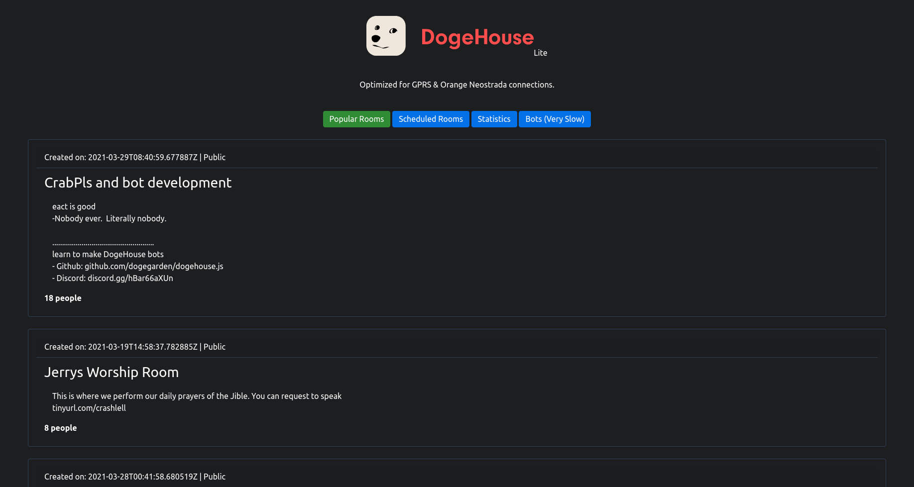

# DogeHouseLite
A lighter version of DogeHouse

Joining rooms is not supported yet, so you will be redirected to the full version of DogeHouse. It uses the DogeGarden API & DogePHP under the hood.



## Optimalizations
DogeHouseLite has been optimized for GPRS & Orange Neostrada internet connections. Some of the optimalizations included:
- Caching
- No JavaScript at all
- CSS files have been reduced to the minimum size
- The SVG Logo was both manually and automatically optimized
- Lazyloading images
- Only 4 requests on the main page (1 html, 1 css, 1 svg and favicon)
- 100% Server Side Rendered
- Without the favicon, only around 10kb of data gets loaded.

### Self-hosting it
1. You are going to need the LAMP stack on your computer (Linux, Apache, MySQL8 and PHP7) and Composer
2. Update the config.php file according to your DB settings
3. Run the SQL Migration located in [app/migrations/dogehouselite.sql](app/migrations/dogehouselite.sql)
4. Create a .htaccessfile and paste the following code in here:
```apache
RewriteEngine On
RewriteCond %{REQUEST_FILENAME} !-f
RewriteCond %{REQUEST_FILENAME} !-d
RewriteRule ^(.*)$ index.php [L,QSA]
```
5. Run `composer dump-autoload`
6. Everything should be up and running.